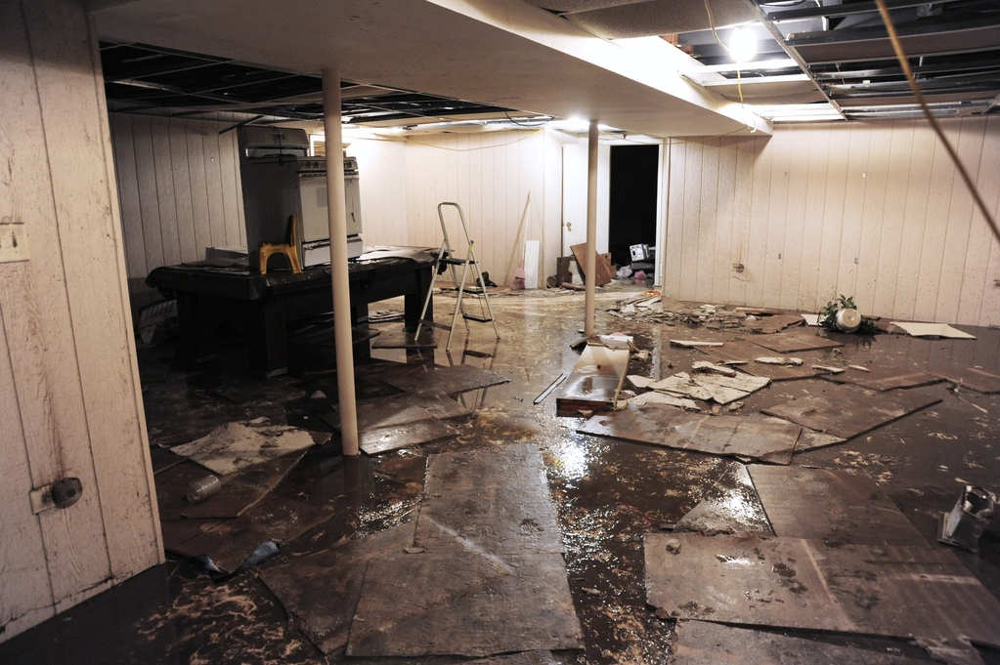

# DUA-VLM-POC
DUA-VLM-PLC is a proof-of-concept testing the feasibility of Vision Language Models (VLMs) to classify and produced structured data from documents and images in support of a [Disaster Unemployment Assistance](https://www.disasterassistance.gov/get-assistance/forms-of-assistance/4466) (DUA) claim. 

This proof-of-concept relies on [MLX-VLM](https://github.com/Blaizzy/mlx-vlm) for inference and fine-tunrning of VLMs on Apple Silicon devices.

This proof-of-concept has been tested with the following models:

* mlx-community/SmolVLM-Instruct-bf16
* mlx-community/llava-interleave-qwen-7b-4bit
* mlx-community/Phi-3.5-vision-instruct-bf16
---

## Table of Contents


- [Requirements](#requirements)
- [Installation](#installation)
- [Usage](#usage)
    - [Models](#models)
    - [System prompts](#system-prompts)
    - [Tests](#tests)
    - [Output and examples](#output-and-examples)
- [Proof of Concept evaluation](#proof-of-concept-evaluation)
- [To-do](#to-do)
- [Changelog](#changelog)

---

## Requirements 

* Apple Silicon. This proof-of-concept makes use of Apple's MLX to run models on Apple Silicon. It will not work, and has not been tested, on non-Apple Silicon. 
* Minimum 32GB RAM. DUA-VLM-POC has been developed and tested on M1 Pro with 32GB of RAM. 

---

## Installation

You will need [uv](https://docs.astral.sh/uv/) to run this proof-of-concept.

---

## Usage

DUA-VLM-POC is designed to run arbitrary tests against arbitrary vision language models.

Run dua-vlm-poc by using uv: 

`uv run dua-vlm-poc.py`

This will download and install any required Python packages and models. 

By default, running dua-vlm-poc.py will:

* use the models specified in models.txt
* run the tests specified in tests.json
* output the results in results.csv

You can override these defaults by specifing arguments:

`uv run dua-vlm-poc.py --models my_models.txt --tests my_tests.csv --output my_results.csv`

will use the specified files as sources for the model list, tests, and output file.

---

### Models

Models are specified in models.txt. Models are referenced by their huggingface path, e.g. mlx-community/SmolLM3-3B-Base-bf16.

models.txt is expected to be in the current working directory of the script.

You must use MLX model weights that run on Apple Silicon. As of writing, Hugging Face hosts over 2,700 [MLX models](https://huggingface.co/mlx-community/models).

Example models.txt:

```
mlx-community/SmolVLM-Instruct-bf16
mlx-community/llava-interleave-qwen-7b-4bit
mlx-community/Phi-3.5-vision-instruct-bf16
```

---

### System prompts

A system prompt can be specified as an argument at runtime. 

A prompt is formed by concatenating the system prompt with the provided test prompt.

|Key|Description|Example value
---|---|---
system_prompt|System prompt as a string|""You are a helpful assistant that extracts detailed structured information from an image and returns the requested information in JSON. Answer the provided questions as a single valid JSON object with nested properties, formatted with standard JSON syntax and indentation for readability. Answer in this format: {'disaster_present': , 'disaster_type':, 'disaster_expanation': }"

---

### Tests

A test is composed of:
* A description
* The prompt for the test
* The path to a directory containing images for the test; the prompt will be run against each image
* An array of expected results; the prompt output will be evaluated against each of the strings in the array

Tests are provided in json with the following keys:

|Key|Description|Example value
---|---|---
test_description|String describing the test|"Self-employment contractor test: type"
prompt|Prompt as a string|"What kind of self-employed work is this an offer for?"
image_directory|Path to directory containing test images|"tests/images/self-employment/offers"
expected_result|Array of expected results|["freelance", "contractor"]


DUA-VLM-POC implements a naive test:

* the prompt output is transformed to lowercase
* the strings in the list expected_results is converted to lower case
* if any of the strings in the list expected_results are in the prompt output, return `True`

### Acceptable image formats
DUA-VLM-POC uses [Pillow](https://python-pillow.github.io) to process images and has been tested with png and jpeg formats.

---

## Output and examples

Output is appended to results.csv in the following format:


### Passed test example

|Column name|Description|Example
---|---|---
timestamp|Timezone timestamp of when the prompt was run|2025-07-29T16:25:51
model|The Hugging Face model path used for the test|mlx-community/SmolVLM-Instruct-bf16
test_description|The provided test description from the test file|Extract the proprietor name from a provided form
image_path|The provided path to the test image
prompt|The provided prompt from the test file|What is the name of the proprietor?
output|The output response from the model|The name of the proprietor is Ricky Nelson.
expected_result|The expected result string from the test file|Ricky Nelson
check|"True" if the test `expected_result` string is present in the output string, otherwise `False`|True


### Failed test example

|Column name|Description|Example
---|---|---
timestamp|Timezone timestamp of when the prompt was run|2025-07-29T16:26:12
model|The Hugging Face model path used for the test|mlx-community/llava-interleave-qwen-7b-4bit
test_description|The provided test description from the test file|Extract the proprietor name from a provided form
prompt|The provided prompt from the test file|What is the name of the proprietor?
output|The output response from the model|The name of the proprietor is not provided in the image.
expected_result|The expected result string from the test file|Ricky Nelson
check|"True" if the test `expected_result` string is present in the output string, otherwise `False`|False

----

## Proof of Concept evaluation

As of 0.1: 

`uv run dua-vlm-poc.py  --system tests/tests_disaster_system_prompt.json --tests tests/tests_disaster.json`

outputs the following:


```
{
  ""disaster_present"": false,
  ""disaster_type"": ""none"",
  ""disaster_explanation"": ""The image provided does not show any evidence of an extreme disaster such as water, fire, wind, or other damage. The wooden house appears undamaged, and there is no visible smoke, debris, or damage to the surrounding environment.""
}
```


```
{
  ""disaster_present"": false,
  ""disaster_type"": ""none"",
  ""disaster_explanation"": ""The image provided does not show any clear evidence of a disaster such as water, fire, wind, or other damage. The house appears undamaged, and there are no visible signs of destruction or distress.""
}
```


```
{
  ""disaster_present"": false,
  ""disaster_type"": ""none"",
  ""disaster_explanation"": ""The image provided does not show any evidence of an extreme disaster such as water, fire, smoke, or wind damage. There are no visible signs of flooding, structural damage, or other indicators of a disaster.""
}

```



```
{
  ""disaster_present"": true,
  ""disaster_type"": ""flood"",
  ""disaster_explanation"": ""The image shows a room with water on the floor, indicating a flood. The presence of water and the state of the room suggest that an extreme disaster has occurred, specifically a flood.""
}
```


```
{
  ""disaster_present"": true,
  ""disaster_type"": ""fire"",
  ""disaster_explanation"": ""The image depicts a scene with houses engulfed in flames, indicating a fire disaster. The flames are visible, and the structures are in a state of destruction, which is characteristic of a fire disaster.""
}
```


---

## To-do
* Model/prompt testing
    * JSON validator for tests so it doesn't just fall over
    * ~~run tests against both a pass/ and a fail/ directory (but only if they exist)~~
    * record whether the images are pass or fail images in the results
    * test image directories could be an array?
    * probably need to provide eval criteria *per test file*

* Safety
    * The function returning images from a path doesn't actually return images from a path. It just returns all files. We need to check that they're actually images.

## To-done
* ~~Add more test data~~
* ~~run a single test against multiple images~~
* Do logging "properly"
* ~~"Tidy up the console output"~~
* Stalls on requiring passing the argument `trust_remote_code=True` for some huggingface models requiring y/n from user
* ~Implement args to allow alternatives to results.csv, tests.csv, and models.txt for users to specify their own results, tests, and models~
* ~~move from personal repo to VLG repo~~
* ~~test against the expected result, duh~~
* ~~the csv should include the test image too, duh~~
* ~~tests should be a tuple: prompt, test data, expected result~~

---

## Latest Version

## 0.1
* Probably getting close to done for now.
* System prompts can now be specified as an argument
* Some tests are outputting the correct data as structured json
* Example failure tests in tests/disaster/fail (just specify the failures in the same test.json file)


## 0.05
* Tests are specified in json now
* Tests specify a prompt that can be run against multiple images, against multiple criteria

## Changelog

### 0.04 

* lines in models.txt will be ignored if they start with a comment (e.g. "# dont-use-this-model/modelname")
* lines in tests.csv will be ignored if they start with a comment (#)
* a models file, output file, and tests file can be specified as arguments, otherwise the defaults are models.txt, results.csv, and tests.csv in the working directory
* Tidied up readme.md
    * Added Requirements
    * Added Installation
    * Added Usage
    * Added model documentation
    * Added test documentation
    * Added output examples


### 0.03
* Only load model once
* Actually do the test

### 0.02 
Moved test/prompt/image/expected result into tests.csv. Here's the columns:
"test_description","prompt","image","expected_result"

Not actually using the eval string yet.

### 0.01 
Prompt is hardcoded in prompts.txt
Models are hardcoded in models.txt
No evals yet.

Only iterates over models.
No support for multiple prompts.

Barely works tbh.


